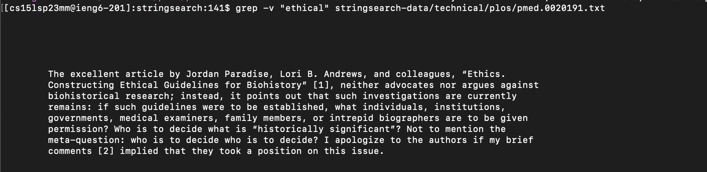
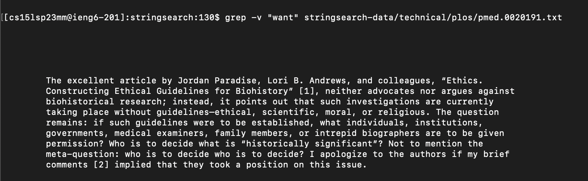
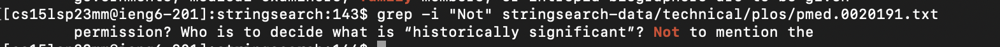
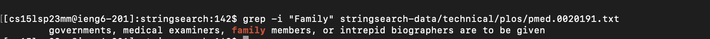
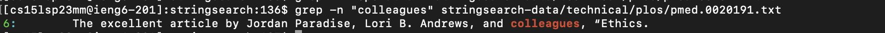
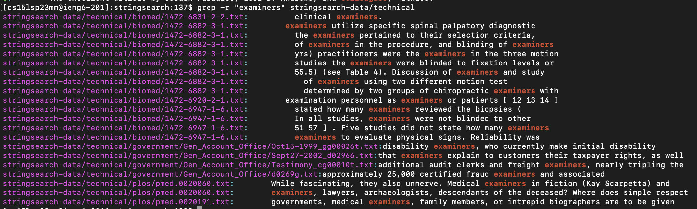
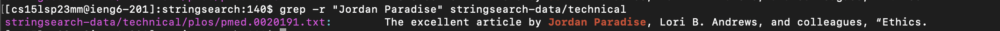

# Lab Report 3: Researching Commands

## **Using Grep Command** 
### What is Grep?
[Definition](https://www.geeksforgeeks.org/grep-command-in-unixlinux/) The grep filter searches a file for a particular pattern of characters, and 
displays all lines that contain that pattern. The pattern that is searched in 
the file is referred to as the regular expression (grep stands for global search 
for regular expression and print out). 

## **Different Grep Commands**
### **grep -v**
Definition: This command with "-v" will give the output with the lines that do not match with the characters or patterns expected. 
Apply It 1: `$ grep -v "ethical" stringsearch-data/technical/plos/pmed.0020191.txt`
Output: 

Apply It 2: `$ grep -v "want" stringsearch-data/technical/plos/pmed.0020191.txt`
Output: 

### **grep -i**
Definition: Finding matches for the expected word in either lower/upper case 
Apply It 1: `$ grep -i "Not" stringsearch-data/technical/plos/pmed.0020191.txt'

Output: 

Apply It 2:`$ grep -v "Familt" stringsearch-data/technical/plos/pmed.0020191.txt`

Output: 

### **grep -n**
Definition: This command gives the output of the lines with matched words and the line number associated with it.
Apply It 1: `$ grep -n "Constructing" stringsearch-data/technical/plos/pmed.0020191.txt`
Output: 

Apply It 2: `$ grep -n "colleagues" stringsearch-data/technical/plos/pmed.0020191.txt`
Output: 

### **grep -r**
Definition: In the directories, -r enables grep to recursively search files
Apply It 1: grep -r "examiners" stringsearch-data/technical
Output: 

Apply It 2: grep -r "Jordan Paradise" stringsearch-data/technical
Output: 
